# VeganPizzeria

Collaborators: [Jane Mansell](https://github.com/JaneMansell) (JM) & [Victoria Daramy-Williams](https://github.com/victoriadw) (VDW)

## Contents
- Introduction
- Installation
  - Technology Stack
  - Instructions
- Usage
  - General
  - Customer usage
    - Signing in/up
    - Placing orders
    - Tracking orders
  - Employee usage
- Future Work

## Introduction
This project is a pizza ordering programme for a vegan pizzeria that allows customers to place pizza orders, track the status of their orders, and additionally provide employees with the ability to manage order details and update order statuses. 
The programme also incorporates an API to showcase cute animal images, enhancing the overall user experience. 

Objectives:
1. Provide a user-friendly interface for customers to browse pizza options, customise their orders, and place orders seamlessly.
2. Implement a tracking system that allows customers to monitor the status of their orders in real-time, providing updates on order preparation, baking, and delivery.
3. Develop an employee portal that enables authorised staff members to access order details and manage order statuses.
4. Integrate an API to fetch and display adorable animal images, creating an engage and enjoyable experience for users.

This project uses the following technologies: Java 17, Maven, Jar, Spring Boot (v 3.1.0), Thymeleaf (v 3.0.4), mySQL, JDBC Template, HTML, CSS, and JavaScript.

Both collaborators contributed equally across all aspects of the project, with the following responsibilities:

| Lead | 	Task                                                          |
|------|----------------------------------------------------------------|
| VDW	 | GUI Styling                                                    |                                              
| VDW	 | Placing orders                                                 |                                              
| VDW	 | New user signup                                                |
| JM	  | Customer check status                                          |
| JM	  | Cook check status and get list of pizzas to cook               |
| JM	  | Cook update status for pickup                                  |
| JM	  | Login and access to relevant screens for employee and customer |

## Installation
### Technology Stack
For ease of use, we recommend using an IDE such as [IntelliJ IDEA](https://www.jetbrains.com/idea/) or [NetBeans](https://netbeans.apache.org/) to run the programme. 
You will also need [MySQL](https://dev.mysql.com/downloads/mysql/), and we recommend using MySQL Workbench to view schemas and data more easily.

### Instructions
You may install the programme by either:
1. Downloading the .zip file and extracting it; or
2. Cloning the repository to their own device.

Once downloaded, open the programme in your chosen IDE.

Before running the programme, the database must be accessible and set up correctly. 
Locate the `application.properties` file (path: `VeganPizzeria > src > main > resources > application.properties`).
Update the properties as necessary to match the database specifications (e.g. update `pizza` in `spring.datasource.password=pizza` with the correct database password). 
Now open the `schema.sql` and `data.sql` files in `resources` in MySQL Workbench and execute them. The databases should now be accessible to the programme. 

Repeat these steps for the `application.properties` file and databases in the test directory (path: `VeganPizzeria > src > test > resources`).

## Usage
### General
The programme should now be ready to run. Locate the `VeganPizzeriaApplication` class (path `VeganPizzeria > src > main > java > com.Plantizza.VeganPizzeria`) and build and run the programme.

Now navigate to http://localhost:8080/ on your browser. You should now see the homepage:

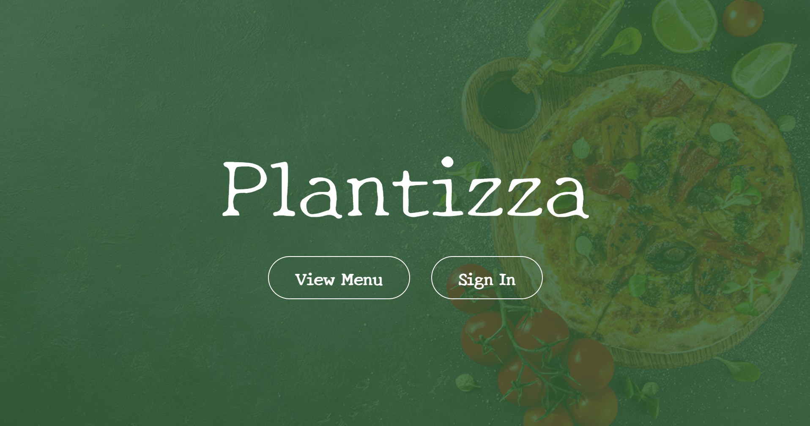

Click on "View Menu" to access the menu. You should see a page that looks like this:

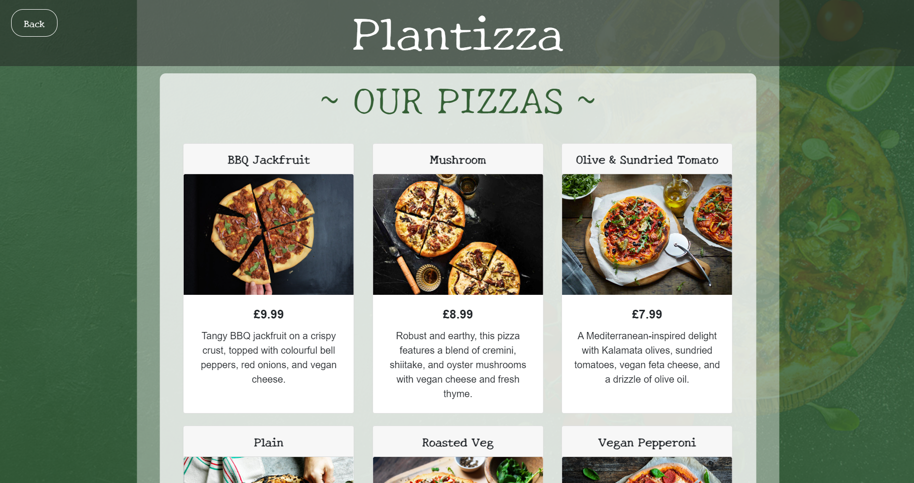

In order to access most of the programme, the user must be signed in. Currently, there are two types of user: customer and employee, so we will go through the different type of usage for both in the following sections.

### Customer usage

#### Signing in/up

Click on "Sign In" on the landing page and sign in with the following credentials:
- Email: judd@gmail.com
- Password: p0okl

Other customer email addresses are accessible in the `data.sql` file. Note that incorrect credentials will cause the page to refresh. 

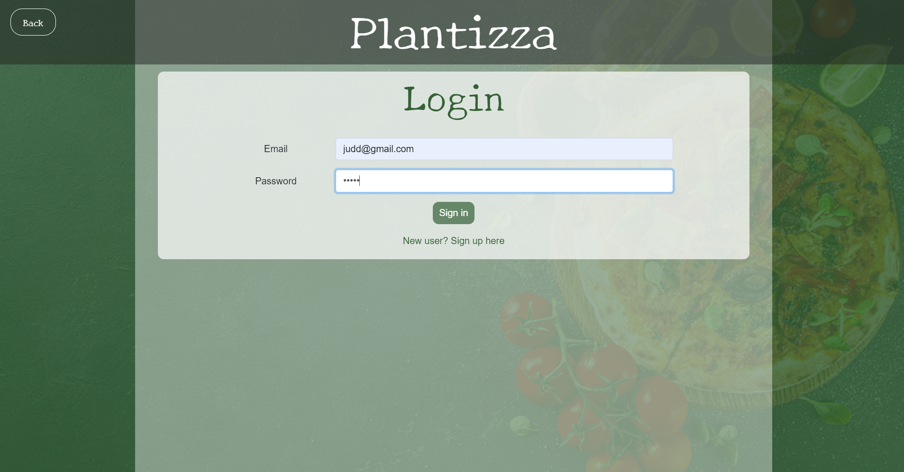

Alternatively, create a new user account by pressing "New user? Sign up here":

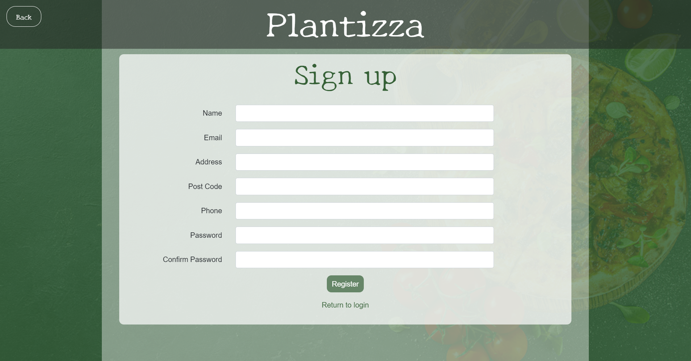

Successful registration will lead you to the following page:

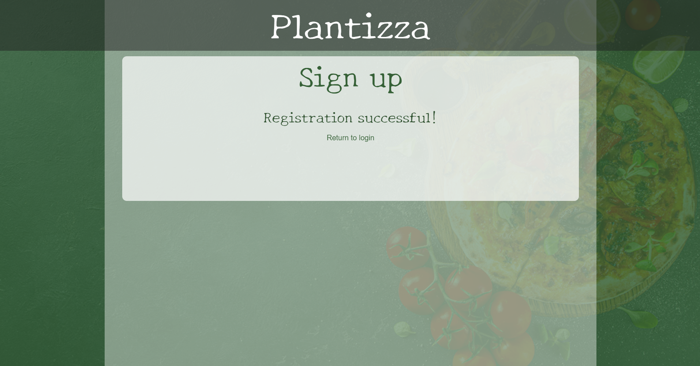

You can then return to the login and sign in with your new account.
Note that entering an email already registered to an account will cause the page to refresh.

#### Placing orders
Signing in will lead to the following page:

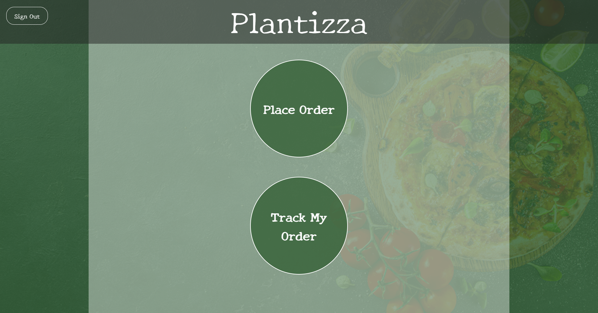

Click on 'Place Order' to start a new order. Pizzas can be added to the order by selecting a pizza type, entering a quantity, and clicking 'Add to Order'. 
You can also toggle through the menu carousel to remind themselves of what is on the menu.

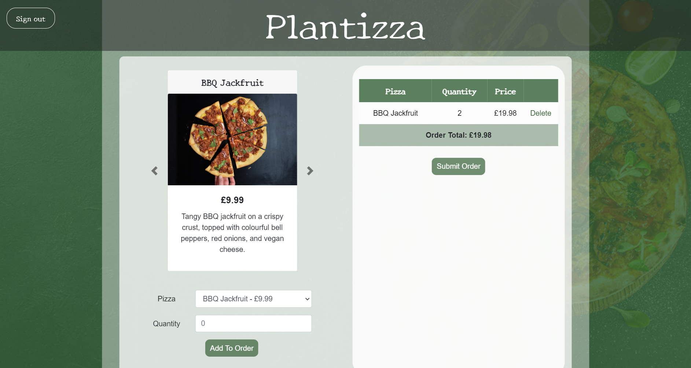

You can also delete pizzas from the order if you change your mind before submitting the order. 
To submit the order, press 'Submit Order'.

#### Tracking orders
When the order is submitted, you will automatically be redirected to the tracking page, which can alternatively also be accessed by the 'Track My Order' button on
the main Customer menu.

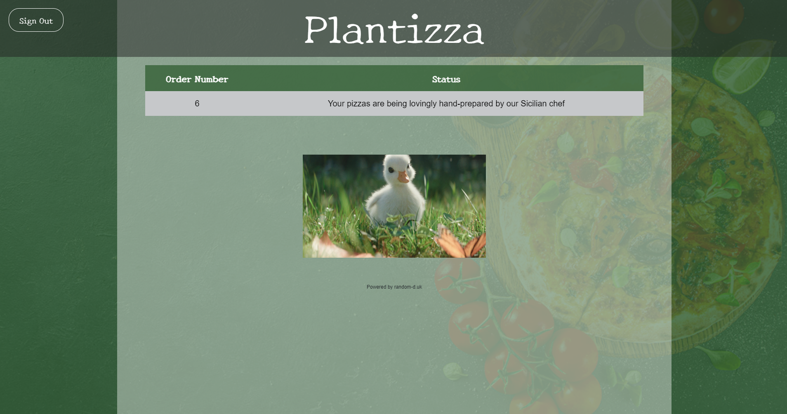

You will see your order number, and the order status, which will change as with employee updates. You will also see an adorable
duck picture/GIF, which will change each time you refresh the page, to keep you entertained!

### Employee usage

#### Signing in
This is the same as signing in as a customer, but this time try these credentials:
- Email: leo@plantizza.com
- Password: p0okl

Again, alternative employee credentials can be accessed in the `data.sql` file.

#### Tracking orders

At the moment, employees only have one option available to them on the menu - 'Track Orders'.

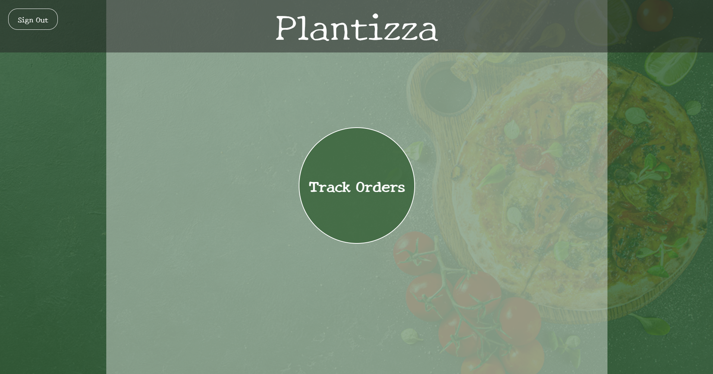

Clicking on the 'Track Orders' button will lead to this page containing the list of orders:

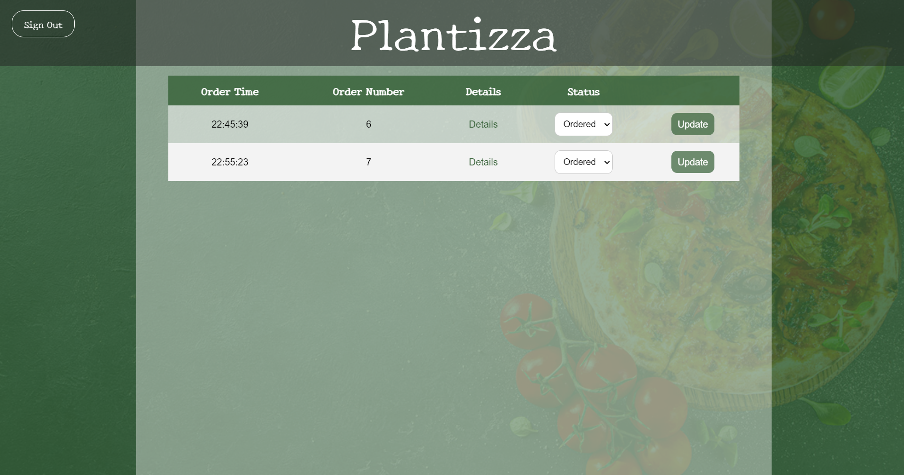

The status can be updated by toggling the drop-down menu and clicking 'Update' to change the status. 
The status change is then fed back to the relevant customer.

The employee can also click on the "Details" for each order to display the pizzas and quantities to be cooked:

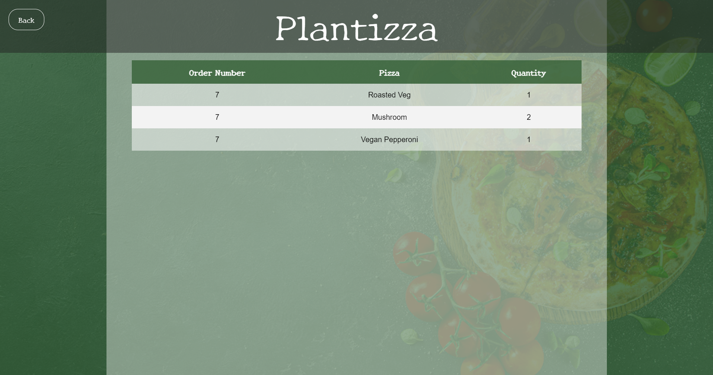

# Future Work

Given the time constraints on the project, we didn't manage to include all the functionality initially planned. We plan to include the following in the future:
1. **Payment**: users will note that there is no payment functionality. We plan to integrate the [PayPal API](https://developer.paypal.com/docs/api/payments/v1/) to support this. 
2. **Different employee types**:
   - Admin - view statistics/analyses/order histories, create new employee accounts, delete orders/accounts
   - Cook - specifically view pizza order details, change status to cooking & ready-for-pickup
   - Delivery person - view customer **and** order details (name, address, phone number, pizzas, pizza quantities), update order to delivered
3. **Mobile compatibility**: Adapt site to be ergonomic for mobile users too.
